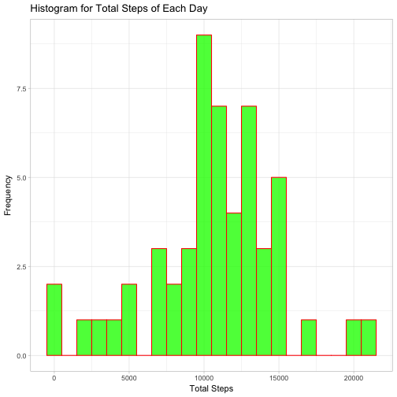
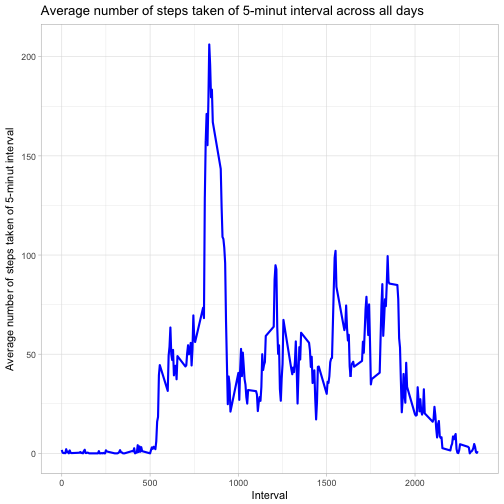
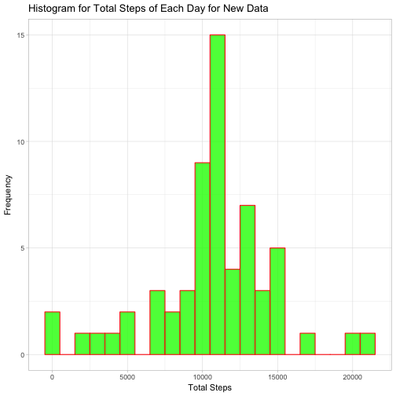
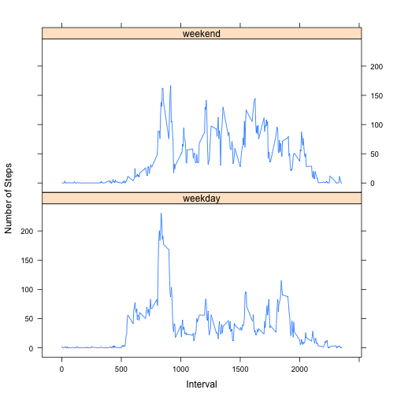

# Course 5 Week 2 Project
Load the data

```r
data=read.csv('/Users/yuanliu/Downloads/activity.csv',sep=',',header=T)
```
Preprocess the data. In this case, the date column is formatted as Date.

```r
data$date=as.Date(data$date)
```
##What is mean total number of steps taken per day?
###1. Calculate the total number of steps taken per day and ignore the missing values

```r
total=aggregate(steps~date,data=data,sum,na.rm=TRUE)
head(total)
```

```
##         date steps
## 1 2012-10-02   126
## 2 2012-10-03 11352
## 3 2012-10-04 12116
## 4 2012-10-05 13294
## 5 2012-10-06 15420
## 6 2012-10-07 11015
```
###2. Histogram of the total number of steps taken per day. 

```r
library(ggplot2)
ggplot(total,aes(steps))+
  geom_histogram(binwidth=1000,col='red',fill='green',alpha=.8)+
  labs(title='Histogram for Total Steps of Each Day')+
  labs(x='Total Steps',y='Frequency')+
  theme_light()
```


###3. Calculate the mean and median of steps taken per day.

```r
mean(total$steps)
```

```
## [1] 10766.19
```

```r
median(total$steps)
```

```
## [1] 10765
```
The mean of total number of steps taken per day is 1.0766189 &times; 10<sup>4</sup>.
The median of total number of steps taken per day is 10765.

##What is average daily activity pattern?

###1. Time series plot of the 5-minut interval and the average number of steps taken, averaged across all days.

```r
avg_interval=aggregate(steps~interval,data=data,FUN="mean")
head(avg_interval)
```

```
##   interval     steps
## 1        0 1.7169811
## 2        5 0.3396226
## 3       10 0.1320755
## 4       15 0.1509434
## 5       20 0.0754717
## 6       25 2.0943396
```
The time series plot is

```r
ggplot(avg_interval,aes(interval,steps))+
  geom_line(color='blue',size=1)+
  labs(title='Average number of steps taken of 5-minut interval across all days')+
  labs(x='Interval',y='Average number of steps taken of 5-minut interval')+
  theme_light()
```


###2. Which 5-minut interval, on average across all the days in the dataset, contains the maximum number of steps?

```r
avg_interval[which(avg_interval$steps==max(avg_interval$steps)),'interval']
```

```
## [1] 835
```
The 835 contains the maximum number of steps.

###Missing Value Processing
###1. The total number of missing vlaues in the dataset. 

```r
sum(is.na(data$steps))
```

```
## [1] 2304
```
There are total 2304missing rows.

###2.Missing Value Imputation.
The strategy is to impute missing value  with the average amount of steps for 5-minut interval. 

###3.New dataset with missing value imputed by the previous strategy.

```r
newdata=data
ind=which(is.na(newdata[,1]))
for (i in ind){
interval_i=newdata[i,'interval']
newdata[i,1]=avg_interval[which(avg_interval$interval==interval_i),'steps']
}
```

###4.Histogram of total number of steps taken per day with new dataset. 

```r
total_new=aggregate(steps~date,data=newdata,sum,na.rm=TRUE)
```

The new histogram plot is 


```r
ggplot(total_new,aes(steps))+
  geom_histogram(binwidth=1000,col='red',fill='green',alpha=.8)+
  labs(title='Histogram for Total Steps of Each Day for New Data')+
  labs(x='Total Steps',y='Frequency')+
  theme_light()
```



The new mean is 

```r
mean(total_new$steps)
```

```
## [1] 10766.19
```
The new median is 

```r
median(total_new$steps)
```

```
## [1] 10766.19
```

The mean from the new dataset doesn't change. The median is close to the mean. 

##Are there differeneces in activity patterns between weekdays and weekends?

###1.Create new factor for new dataset. There are two levels: weekday and weekend.


```r
newdata$weekday=ifelse(weekdays(newdata$date)%in%c('Saturday','Sunday'),'weekend','weekday')
newdata$weekday=factor(newdata$weekday)
```
###2.Make a panel plot containing a time series plot (i.e. type = "l") of the 5-minute interval (x-axis) and the average number of steps taken, averaged across all weekday days or weekend days (y-axis).


```r
mean_new=aggregate(steps~interval+weekday,data=newdata,FUN='mean')
library(lattice)
xyplot(steps~interval|weekday,data=mean_new,layout=c(1,2),type='l',xlab='Interval',ylab='Number of Steps')
```



